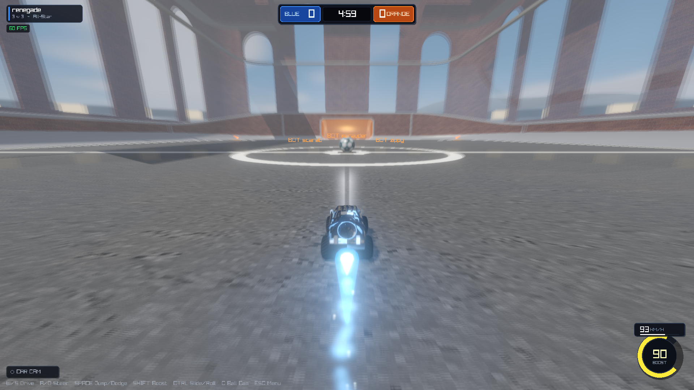

# SARPBC-C (Supersonic Acrobatic Rocket-Powered Battle-Cars)

A high-performance C99 & Raylib recreation of the classic arcade physics car-soccer game **Supersonic Acrobatic Rocket-Powered Battle-Cars** (SARPBC), the original predecessor to *Rocket League*.



---

## Features

### 🏎️ Vehicle Physics & Mechanics
- **Authentic Vehicle Dynamics:** Raycast suspension spring-damper simulation, non-linear tire friction curves with slip angles, weight transfer, and powerslide handbraking.
- **Acrobatic Maneuvers:** Single jump, held apex jumps, double-jump, 8-directional aerial dodges/flips with torque impulses and cancel mechanics.
- **Wall & Aerial Driving:** Wall transition ramps with sticky downward downforce, ceiling driving, and full 3D aerial pitch/yaw/roll flight with rocket boost thruster physics.
- **Supersonic Speed & Demolitions:** Supersonic speed threshold with Mach cone shockwaves. Ramming opponent cars at supersonic speeds triggers explosive demolitions with blast impulses, custom wreckage particle FX, and a 3-second respawn timer.

### ⚽ Ball Physics & Authentic Visuals
- **Mathematical Truncated Icosahedron Ball:** Procedurally generated in spherical geodesic Voronoi space matching Raylib's sphere mesh parameterization (12 pentagon centers, 20 hexagon centers).
- **Surface Detailing:** Dark recessed panel seams with ambient occlusion bevels, glowing electric cyan and amber energy circuitry tracks, carbon-fiber stealth pentagons with glowing neon concentric rings, and brushed titanium cross-weave hexagon plates.
- **Dynamic Spin & Restitution:** Bounces with accurate Magnus effect and surface spin transfer.

### 🤖 Intelligent AI Bots
- **Tiered Skill Levels:** Rookie, Pro, and All-Star bot behaviors.
- **Full Player Parity:**
  - Forward kickoff dodges, tactical diagonal flips, and recovery rolls.
  - Power slide drift cuts to decrease turn radius on sharp angles.
  - Tactical boost pad routing, boost feathering, and aerial boost flight for high balls.
  - Wall climbing and corner reads.
  - Aggressive supersonic demo hunting against opponents in the box.

### 🏟️ Visuals, Shaders & Post-Processing
- **Atmospheric Stadium Skybox:** Procedural stadium dome skybox featuring Rayleigh/Mie daytime gradient, sun corona flare, multi-octave drifting cumulus clouds, 4 corner stadium lattice floodlight towers with bloom flares and downward light beams, and distant horizon mountain silhouettes.
- **Particle Systems:** Multi-stage rocket boost exhaust flames, asphalt tire smoke/sparks during powerslides, sonic boom shockwaves, fiery demolition explosions, and goal blast confetti.
- **HDR & Color Grading:** 4096² PCF soft shadows, multi-mip bloom chain, linear lighting, ACES tonemapping, vignette, and FXAA antialiasing.

### 📊 Modernized Broadcast HUD & Menus
- **Stadium Broadcast Scoreboard:** Frosted glass container with Blue and Orange team crests, digital match clock, and overtime pulsing.
- **Radial Boost Gauge & Speedometer:** Curved radial energy arc, digital percentage readout, digital `KM/H` speedometer, and supersonic alert banner.
- **Tactical Badges:** Dedicated ball-cam mode indicator (`[BALL CAM ON]` vs `[CAR CAM]`), player card, and dynamic demolition/goal ribbons.
- **Frosted Glass Menus:** Smooth menus with car selection (13 original cars), skins, game mode (1v1, 2v2, 3v3, 4v4), and camera settings.

---

## Controls

| Action | Keyboard / Mouse | Xbox / Standard Gamepad |
| :--- | :--- | :--- |
| **Throttle / Reverse** | `W` / `S` | Right Trigger / Left Trigger |
| **Steer** | `A` / `D` | Left Stick (Horizontal) |
| **Jump / Dodge** | `Space` | `A` (Face Down) |
| **Rocket Boost** | `Left Shift` | `B` (Face Right) |
| **Handbrake / Air Roll**| `Left Ctrl` | `X` (Face Left) |
| **Air Pitch** | `W` / `S` | Left Stick (Vertical) |
| **Air Roll (Keys)** | `Q` / `E` | Left Bumper / Right Bumper |
| **Toggle Ball Cam** | `C` | `Y` (Face Up) |
| **Pause / Menu** | `Esc` / `P` | `Start` / Menu Button |
| **Reset Kickoff** | `R` | `Back` / View Button |

---

## Quick Start

### Prerequisites
- Windows 10/11 (64-bit)
- PowerShell (built-in)

### Running the Game
To launch the game immediately:
```powershell
cd game
.\run.ps1
```

### Building from Source
To rebuild `sarpbc.exe` and `sarpbc_game.dll`:
```powershell
cd game
.\build.ps1
```

### Running Automated Physics & AI Tests
```powershell
cd game
.\run.ps1 --test
```

---

## Project Structure

```
├── game/
│   ├── src/
│   │   └── main.c           # Complete game simulation, physics, AI, rendering, HUD
│   ├── build.ps1            # C99 build script (produces sarpbc.exe & sarpbc_game.dll)
│   ├── run.ps1              # Launch script with Raylib environment setup
│   └── settings.ini         # Camera, FOV, and user preferences
├── export_c/
│   ├── arena/               # Converted stadium mesh, collision geometry, textures
│   ├── cars/                # 13 authentic car models, liveries, specs
│   └── include/sarm.h       # Binary model format specification
└── tools/
    └── raylib-6.0_win64_mingw-w64/ # Raylib 6.0 C libraries and headers
```
